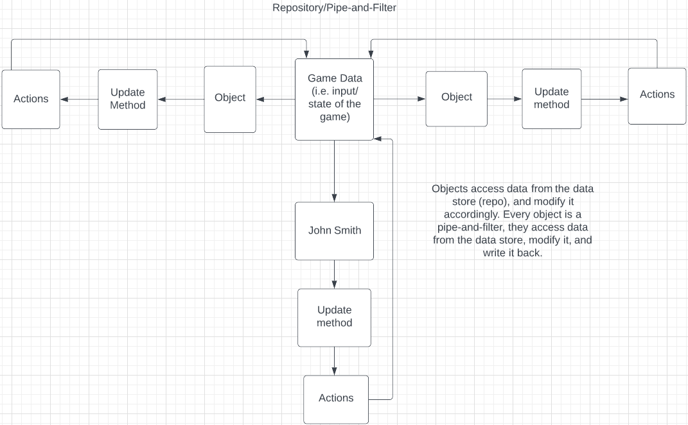

# John Smith Design

- Objects access data from the centralized database, modify it accordingly, and then write the updated data back to the database.
- This happens every frame.

## Architecture: Repository Model

The architecture design for John Smith is a Repository/Pipe-and-Filter model. We went with this design because our game revolves around a central data store whose data is accessed and modified repeatedly by game objects. (eg: John Smith, enemies, etc..) Every object acts as its own pipe and filter.

Any object with a script has an Update() function that is is called once per frame, so the centralized database is accessed/modified quite a bit.
