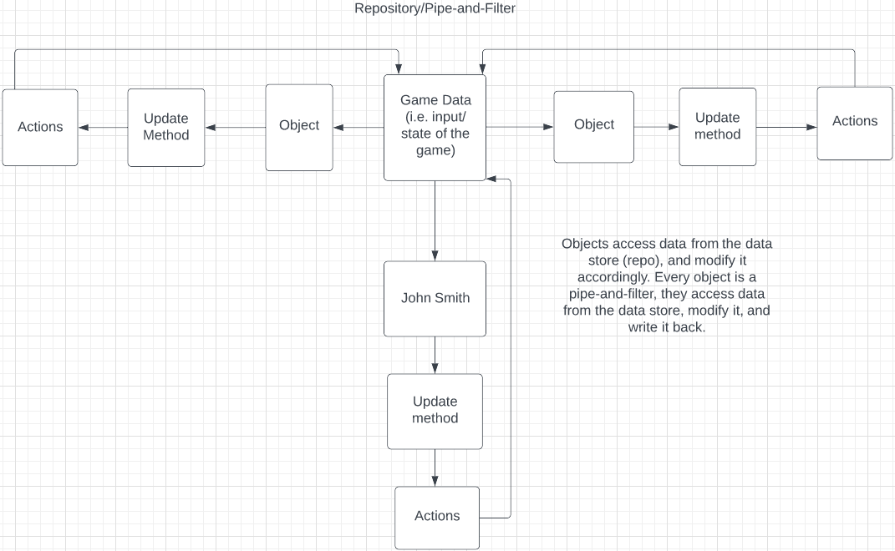

# John Smith Design

- Objects access data from the centralized database, modify it accordingly, and then write the updated data back to the database.
- This happens every frame.

## Architecture: Repository Model

The architecture design for John Smith is a Repository/Pipe-and-Filter model. We went with this design because our game revolves around a central data store whose data is accessed and modified repeatedly by game objects. (eg: John Smith, enemies, etc..) Every object acts as its own pipe and filter.

Any object with a script has an Update() function that is called once per frame, so the centralized database is accessed/modified quite a bit.

## Major classes

### John Smith
This is the most important class in the entire project. The John Smith class reads keyboard input from the user and depending on what the input is, John Smith acts accordingly. The entire game revolves around John Smith (the player) and the interactions they have with the game world.

### Health
This class is really important to the game as well. Without it there would be no challenge. The Health class has 2 sub-classes that are the "Health bar" and the "Health Collectible". Both of these classes interact with the Health class so that John Smith's health is displayed correctly, and John Smith reacts accordingly when being dealt damage.

### Brussel Sprout
This class is the only enemy in the game for now. The Brussel Sprout is the only object in the game (for now) that can deal damage to John Smith. This class does not rely on John Smith to function, but without John Smith, this class would have no purpose being in the game.

### Pause Menu
This class allows the user to quit/pause the game anytime during gameplay. 
